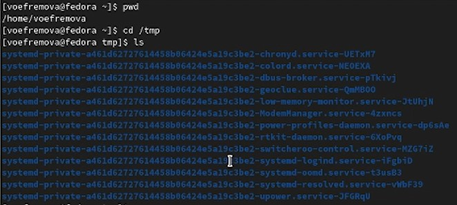
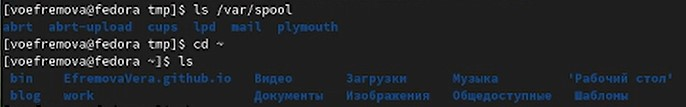
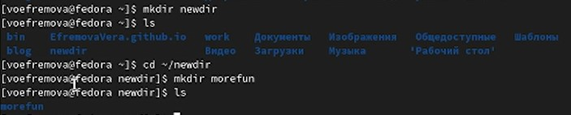
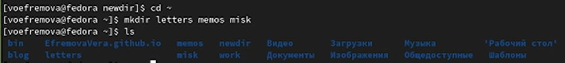
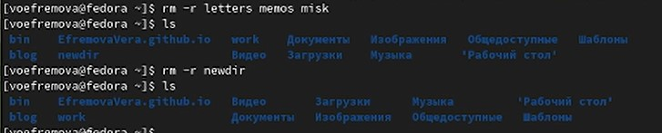
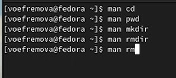
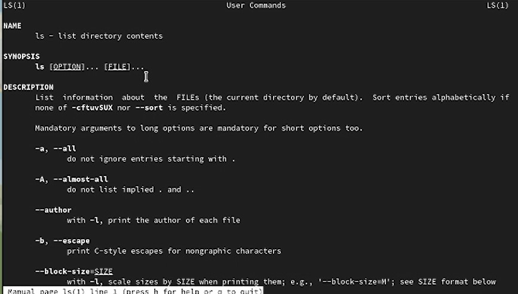
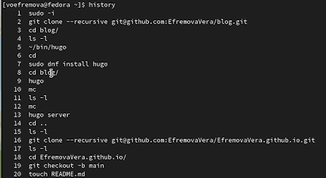
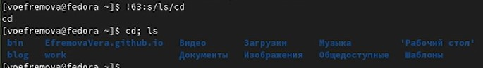

---
## Front matter
lang: ru-RU
title: Презентация лабораторной работы №4
author:
  - Ефремова В.
institute:
  - Российский университет дружбы народов, Москва, Россия
date: 04 марта 2004

## i18n babel
babel-lang: russian
babel-otherlangs: english

## Formatting pdf
toc: false
toc-title: Содержание
slide_level: 2
aspectratio: 169
section-titles: true
theme: metropolis
header-includes:
 - \metroset{progressbar=frametitle,sectionpage=progressbar,numbering=fraction}
 - '\makeatletter'
 - '\beamer@ignorenonframefalse'
 - '\makeatother'
---

# Информация

## Докладчик

:::::::::::::: {.columns align=center}
::: {.column width="70%"}

  * Ефремова Вера
  * студент
  * Направление бизнес-информатика
  * Российский университет дружбы народов
  * [1032225672@rudn.ru]
  * <https://EfremovaVera.github.io/ru/>

:::
::: {.column width="30%"}

:::
::::::::::::::

# Вводная часть

## Объект и предмет исследования

- Командная строка
- Линукс
- Входные и выходные форматы команд

## Цели и задачи

- Приобретение практических навыков взаимодействия пользователя с системой посредством командной строкой.

## Материалы и методы

- Командная строка
- Виртуальная машина

# Презентация

## Первый этап

- Через команду pwd вывели имя домашнего каталога и перешли в каталог tmp, потом через команду ls посмотрели, что находится в это каталоге

## Второй этап

- Смотрим список каталогов в /var/spool и не находим нужный нам подкаталог. Переходим в домашний каталог и смотрим список каталогов

## Третий этап

- Через команду mkdir создаём каталог и подкаталог, и также делаем проверку

## Четвертый этап

- Рекурсивно создаём 3 каталога и проверяем их наличие в домашнем каталоге

## Пятый этап

- Удаляем ,созданные нами ,каталоги и подкаталоги, а также делаем проверку

## Шестой этап

- Смотрим как работает команда man и просматриваем характеристики следующих команд из условия

## Седьмой этап

- Сам спсиок характеристики команд через команду man 

## Восьмой этап

- Через команду история мы можем посмотреть все совершенные нами команды на данной машине

## Девятый этап

- Модифицируем команду лс и выполним сразу две команды одновременно

## Вывод

- Научились работать с командной строкой
- Посмотрели разное использование команд
- Узнали новые команды

:::

