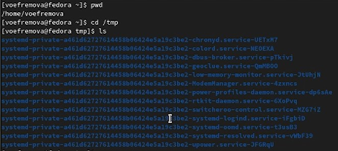
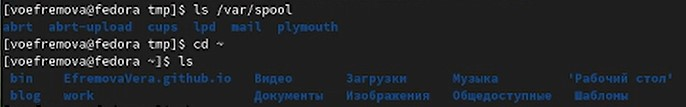
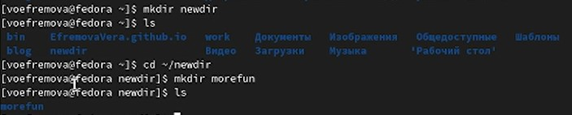
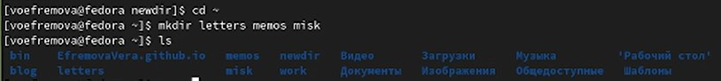
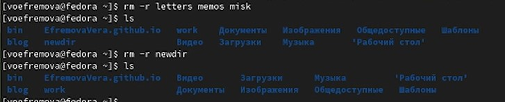
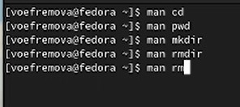
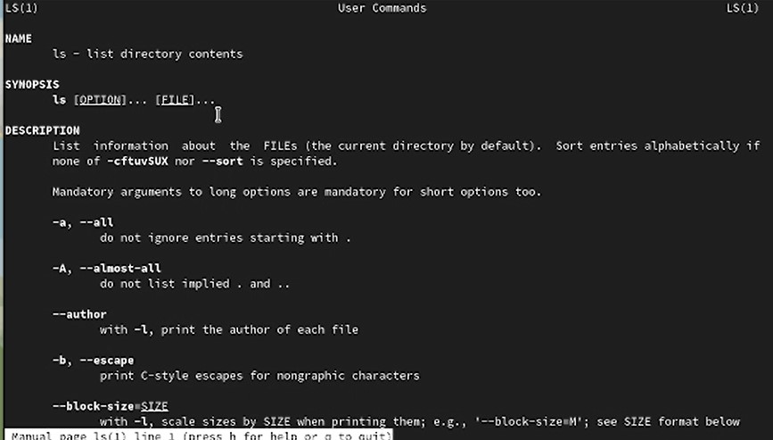
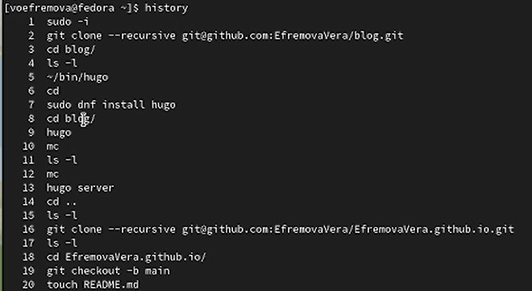
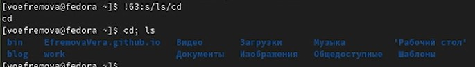

---
## Front matter
title: "Лабораторная работа №4"
author: "Ефремова Вера"

## Generic otions
lang: ru-RU
toc-title: "Содержание"

## Bibliography
bibliography: bib/cite.bib
csl: pandoc/csl/gost-r-7-0-5-2008-numeric.csl

## Pdf output format
toc: true # Table of contents
toc-depth: 2
lof: true # List of figures
lot: true # List of tables
fontsize: 12pt
linestretch: 1.5
papersize: a4
documentclass: scrreprt
## I18n polyglossia
polyglossia-lang:
  name: russian
  options:
	- spelling=modern
	- babelshorthands=true
polyglossia-otherlangs:
  name: english
## I18n babel
babel-lang: russian
babel-otherlangs: english
## Fonts
mainfont: PT Serif
romanfont: PT Serif
sansfont: PT Sans
monofont: PT Mono
mainfontoptions: Ligatures=TeX
romanfontoptions: Ligatures=TeX
sansfontoptions: Ligatures=TeX,Scale=MatchLowercase
monofontoptions: Scale=MatchLowercase,Scale=0.9
## Biblatex
biblatex: true
biblio-style: "gost-numeric"
biblatexoptions:
  - parentracker=true
  - backend=biber
  - hyperref=auto
  - language=auto
  - autolang=other*
  - citestyle=gost-numeric
## Pandoc-crossref LaTeX customization
figureTitle: "Рис."
tableTitle: "Таблица"
listingTitle: "Листинг"
lofTitle: "Список иллюстраций"
lotTitle: "Список таблиц"
lolTitle: "Листинги"
## Misc options
indent: true
header-includes:
  - \usepackage{indentfirst}
  - \usepackage{float} # keep figures where there are in the text
  - \floatplacement{figure}{H} # keep figures where there are in the text
---

# Цель работы

Приобретение практических навыков взаимодействия пользователя с системой посредством командной строкой.

# Теоретическое введение

Здесь описываются теоретические аспекты, связанные с выполнением работы.

Например, в табл. @tbl:std-dir приведено краткое описание стандартных каталогов Unix.

: Описание некоторых каталогов файловой системы GNU Linux {#tbl:std-dir}

| Имя каталога | Описание каталога                                                                                                          |
|--------------|----------------------------------------------------------------------------------------------------------------------------|
| `/`          | Корневая директория, содержащая всю файловую                                                                               |
| `/bin `      | Основные системные утилиты, необходимые как в однопользовательском режиме, так и при обычной работе всем пользователям     |
| `/etc`       | Общесистемные конфигурационные файлы и файлы конфигурации установленных программ                                           |
| `/home`      | Содержит домашние директории пользователей, которые, в свою очередь, содержат персональные настройки и данные пользователя |
| `/media`     | Точки монтирования для сменных носителей                                                                                   |
| `/root`      | Домашняя директория пользователя  `root`                                                                                   |
| `/tmp`       | Временные файлы                                                                                                            |
| `/usr`       | Вторичная иерархия для данных пользователя                                                                                 |

Более подробно об Unix см. в [@gnu-doc:bash;@newham:2005:bash;@zarrelli:2017:bash;@robbins:2013:bash;@tannenbaum:arch-pc:ru;@tannenbaum:modern-os:ru].

# Выполнение лабораторной работы

1.  Черз команду pwd вывели имя домашнего каталога и перешли в каталог tmp, потом через команду ls посмотрели, что находится в это каталоге (рис. @fig:001).

{#fig:001 width=70%}

2. Смотрим список каталогов в /var/spool и не находим нужный нам подкаталог. Переходим в домашний каталог и смотрим список каталогов(рис. @fig:002) 

{#fig:002 width=70%}

3. Через команду mkdir создаём каталог и подкаталог, и также делаем проверку(рис. @fig:003)

{#fig:003 width=70%}

4. Рекурсивно создаём 3 каталога и проверяем их наличие в домашнем каталоге(рис. @fig:004)

{#fig:004 width=70%}

5. Удаляем ,созданные нами ,каталоги и подкаталоги, а также делаем проверку(рис. @fig:005)

{#fig:005 width=70%}

6. Смотрим как работает команда man и просматриваем характеристики следующих команд из условия (рис. @fig:006)

{#fig:006 width=70%}

7. Сам спсиок характеристики команд через команду man (рис. @fig:007)

{#fig:007 width=70%}

8. Через команду история мы можем посмотреть все совершенные нами команды на данной машине(рис. @fig:008)

{#fig:008 width=70%}

9. Модифицируем команду лс и выполним сразу две команды одновременно(рис. @fig:009)

{#fig:009 width=70%}

# Выводы

Мы приобрели практические навыки работы с системой командной строки.

::: {#refs}
:::
