---
## Front matter
lang: ru-RU
title: Презентация лабораторной работы №5
author:
  - Ефремова В.
institute:
  - Российский университет дружбы народов, Москва, Россия
date: 11 марта 2023

## i18n babel
babel-lang: russian
babel-otherlangs: english

## Formatting pdf
toc: false
toc-title: Содержание
slide_level: 2
aspectratio: 169
section-titles: true
theme: metropolis
header-includes:
 - \metroset{progressbar=frametitle,sectionpage=progressbar,numbering=fraction}
 - '\makeatletter'
 - '\beamer@ignorenonframefalse'
 - '\makeatother'
---

# Информация

## Докладчик

:::::::::::::: {.columns align=center}
::: {.column width="70%"}

  * Ефремова Вера
  * студент
  * Направление бизнес-информатика
  * Российский университет дружбы народов
  * [1032225672@rudn.ru]
  * <https://EfremovaVera.github.io/ru/>

:::
::: {.column width="30%"}

:::
::::::::::::::

# Вводная часть

## Объект и предмет исследования

- Командная строка
- Линукс
- Входные и выходные форматы команд

## Цели и задачи

- Ознакомление с файловой системой Линукс, её структурой, именами и содержанием каталогов. Приобретение практических навыков по применению команд для работа с файлами и каталогами, по управлению процессами, по проверке использования диска и обслуживанию файловой системы.

## Материалы и методы

- Командная строка
- Виртуальная машина

# Презентация

## Первый этап

- В 1 примере дано упражнение на копирование файлов и каталогов с помощью команды cp  

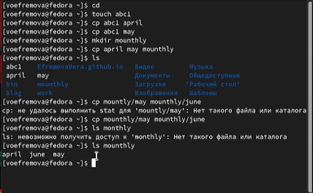

## Второй этап

- Во 2 примере дано копирование файлов в текущем каталоге 

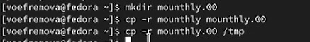

## Третий этап

- В 3 примере даны упражнения на перемещение и переименование с помощью команды mv 

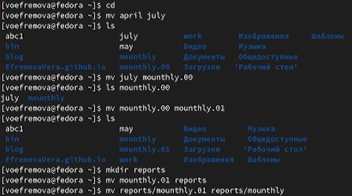

## Четвертый этап

- В данном примере мы меняли права файлов с помощью команды chmod 

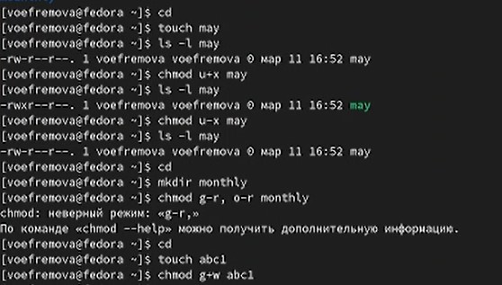

## Пятый этап

- Копируем файл в домашний каталог с помощью команды . Создадим директорию и переместим туда файл с помощью команд mkdir и mv  , а потом переименуем его с помощью команды mv 

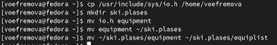

## Шестой этап

- Используем раннее созданный файл в примере. Переместим его в каталог и переименуем с помощью команды mv 

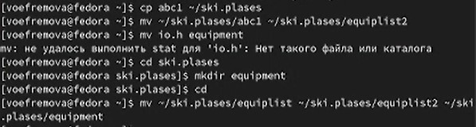

## Седьмой этап

- Создадим новый каталог и переместим его в другой каталог, а потом поменяем название с помощью команды mv 

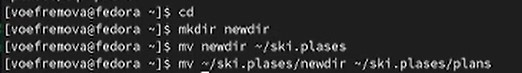

## Восьмой этап

- У файла australia, который надо создать, надо поменять права с помощью команд mkdir и chmod g-x, o-x,g-w

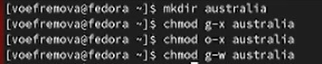

## Девятый этап

- У файла play меняем права с помощью команды chmod g-r, g-w

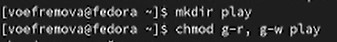

## Десятый этап

- У файла my_os тоже меняем права с помощью команды chmod u-w,u+x,g-x

## 11 этап

- Создаем 4 файл

## 12 этап

- Меняем права созданного файла с помощью команды chmod u-x

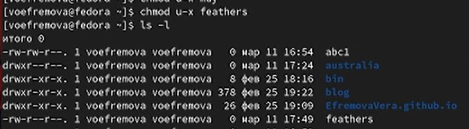

## 13 этап

- Скопируем файл в другой файл. Переместим файл в каталог. Скопируем каталог в каталог. Переместим каталог в другой каталог и переименуем. Все эти действия сопровождаются командами cp и mv

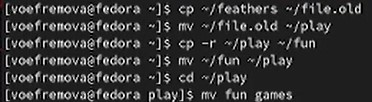

## 14 этап
- Меняем права на доступ к чтению и проверяем, что будет с помощью команд chmod, cd и cat

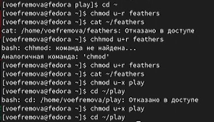

## 15 этап

- Смотрим характеристику команд. Первая команда для монтирования файлов. Вторая команда для проверки целостности файлов. Третья команда для создания файловой системы и четвертая команда для принудительного завершения.

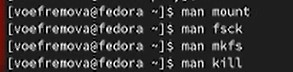

## Вывод

- Мы ознакомились с файловой системой Линукс, её структурой, именами и содержанием каталогов. Приобрели практические навыкм по применению команд для работа с файлами и каталогами, по управлению процессами, по проверке использования диска и обслуживанию файловой системы.

:::

