---
## Front matter
title: "Лабораторная работа №5"
author: "Ефремова Вера"

## Generic otions
lang: ru-RU
toc-title: "Содержание"

## Bibliography
bibliography: bib/cite.bib
csl: pandoc/csl/gost-r-7-0-5-2008-numeric.csl

## Pdf output format
toc: true # Table of contents
toc-depth: 2
lof: true # List of figures
lot: true # List of tables
fontsize: 12pt
linestretch: 1.5
papersize: a4
documentclass: scrreprt
## I18n polyglossia
polyglossia-lang:
  name: russian
  options:
	- spelling=modern
	- babelshorthands=true
polyglossia-otherlangs:
  name: english
## I18n babel
babel-lang: russian
babel-otherlangs: english
## Fonts
mainfont: PT Serif
romanfont: PT Serif
sansfont: PT Sans
monofont: PT Mono
mainfontoptions: Ligatures=TeX
romanfontoptions: Ligatures=TeX
sansfontoptions: Ligatures=TeX,Scale=MatchLowercase
monofontoptions: Scale=MatchLowercase,Scale=0.9
## Biblatex
biblatex: true
biblio-style: "gost-numeric"
biblatexoptions:
  - parentracker=true
  - backend=biber
  - hyperref=auto
  - language=auto
  - autolang=other*
  - citestyle=gost-numeric
## Pandoc-crossref LaTeX customization
figureTitle: "Рис."
tableTitle: "Таблица"
listingTitle: "Листинг"
lofTitle: "Список иллюстраций"
lotTitle: "Список таблиц"
lolTitle: "Листинги"
## Misc options
indent: true
header-includes:
  - \usepackage{indentfirst}
  - \usepackage{float} # keep figures where there are in the text
  - \floatplacement{figure}{H} # keep figures where there are in the text
---

# Цель работы

Ознакомление с файловой системой Линукс, её структурой, именами и содержанием каталогов. Приобретение практических навыков по применению команд для работа с файлами и каталогами, по управлению процессами, по проверке использования диска и обслуживанию файловой системы.

# Выполнение лабораторной работы

1. В 1 примере дано упражнение на копирование файлов и каталогов с помощью команды cp  (рис. @fig:001).

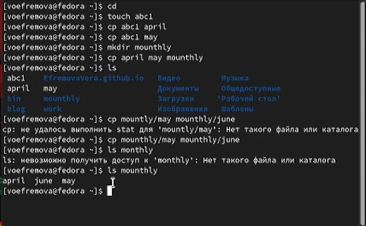{#fig:001 width=70%}

2. Во 2 примере дано копирование файлов в текущем каталоге (рис. @fig:002) 

{#fig:002 width=70%}

3. В 3 примере даны упражнения на перемещение и переименование с помощью команды mv (рис. @fig:003)

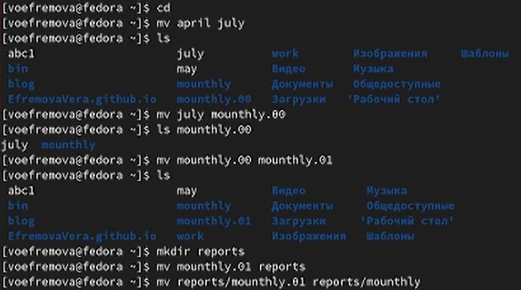{#fig:003 width=70%}

4. В данном примере мы меняли права файлов с помощью команды chmod (рис. @fig:004)

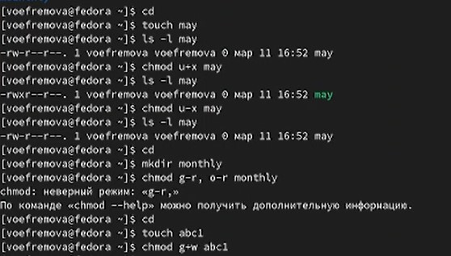{#fig:004 width=70%}

5. Копируем файл в домашний каталог с помощью команды . Создадим директорию и переместим туда файл с помощью команд mkdir и mv  , а потом переименуем его с помощью команды mv (рис. @fig:005)

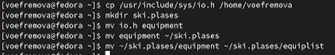{#fig:005 width=70%}

6. Используем раннее созданный файл в примере. Переместим его в каталог и переименуем с помощью команды mv (рис. @fig:006)

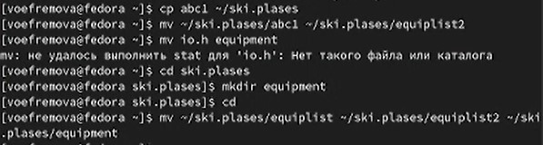{#fig:006 width=70%}

7. Создадим новый каталог и переместим его в другой каталог, а потом поменяем название с помощью команды mv (рис. @fig:007)

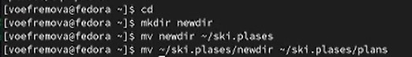{#fig:007 width=70%}

8. У файла australia, который надо создать, надо поменять права с помощью команд mkdir и chmod g-x, o-x,g-w(рис. @fig:008)

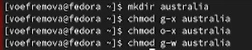{#fig:008 width=70%}

9. У файла play меняем права с помощью команды chmod g-r, g-w(рис. @fig:009)

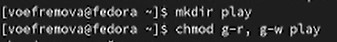{#fig:009 width=70%}

10. У файла my_os тоже меняем права с помощью команды chmod u-w,u+x,g-x(рис. @fig:010)

{#fig:010 width=70%}

11. Создаем 4 файл(рис. @fig:011)

{#fig:011 width=70%}

12. Меняем права созданного файла с помощью команды chmod u-x(рис. @fig:012)

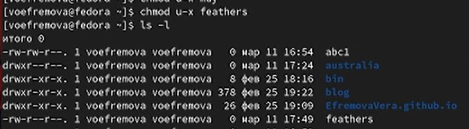{#fig:012 width=70%}

13. Скопируем файл в другой файл. Переместим файл в каталог. Скопируем каталог в каталог. Переместим каталог в другой каталог и переименуем. Все эти действия сопровождаются командами cp и mv(рис. @fig:013)

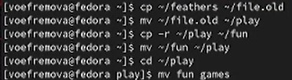{#fig:013 width=70%}

14. Меняем права на доступ к чтению и проверяем, что будет с помощью команд chmod, cd и cat(рис. @fig:014)

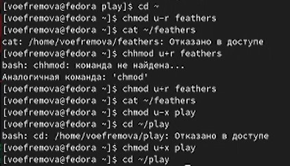{#fig:014 width=70%}

15. Смотрим характеристику команд. Первая команда для монтирования файлов. Вторая команда для проверки целостности файлов. Третья команда для создания файловой системы и четвертая команда для принудительного завершения.(рис. @fig:015)

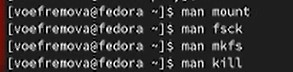{#fig:015 width=70%}

# Выводы

Мы ознакомились с файловой системой Линукс, её структурой, именами и содержанием каталогов. Приобрели практические навыкм по применению команд для работа с файлами и каталогами, по управлению процессами, по проверке использования диска и обслуживанию файловой системы.

::: {#refs}
:::
