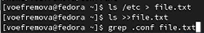
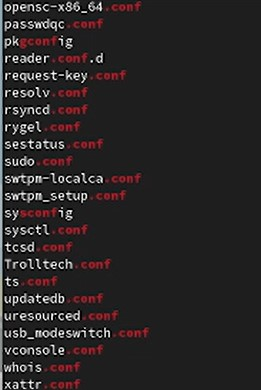
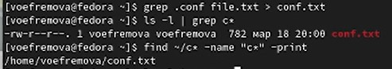
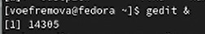
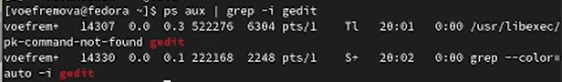
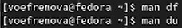
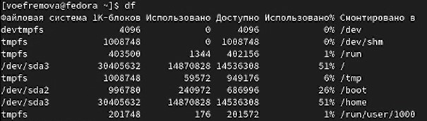
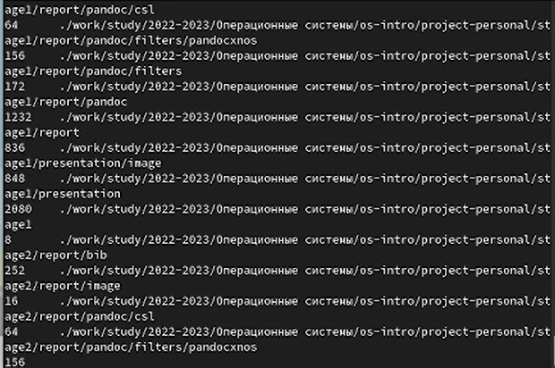
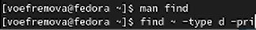
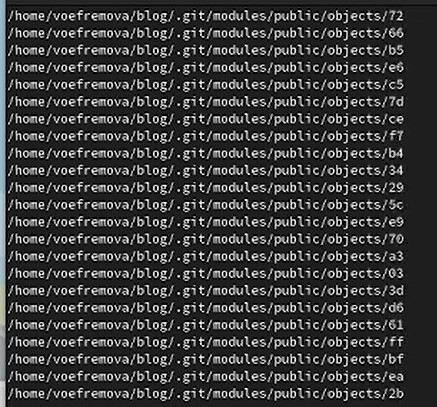

---
## Front matter
lang: ru-RU
title: Презентация к лабораторной работе №6
author:
  - Ефремова Вера
institute:
  - Российский университет дружбы народов, Москва, Россия
date: 18 марта 2023

## i18n babel
babel-lang: russian
babel-otherlangs: english

## Formatting pdf
toc: false
toc-title: Содержание
slide_level: 2
aspectratio: 169
section-titles: true
theme: metropolis
header-includes:
 - \metroset{progressbar=frametitle,sectionpage=progressbar,numbering=fraction}
 - '\makeatletter'
 - '\beamer@ignorenonframefalse'
 - '\makeatother'
---

# Информация

## Докладчик

:::::::::::::: {.columns align=center}
::: {.column width="70%"}

  * Ефремова Вера
  * студент
  * Направление бизнес-информатика
  * Российский университет дружбы народов
  * [1032225672@rudn.ru]
  * <https://EfremovaVera.github.io/ru/>

:::
::: {.column width="30%"}

:::
::::::::::::::

# Вводная часть

## Объект и предмет исследования

- Командная строка
- Линукс
- Входные и выходные форматы команд

## Цели и задачи

- Ознакомление с инструментами поиска файлов и фильтрации текстовых данных. Приобретение практических навыков: по управлению процессами (и заданиями), по проверке использования диска и обслуживанию файловых систем.

# Презентация
## Первый этап

- Вошли под именем пользователя. Записали в файл file.txt названия файлов,содержащихся в каталоге /etc, а потом вывели эти файлы,имеющие расширение .conf 

## Второй этап

- Вывод содержания 

## Третий этап

- Записали их в новый текстовой файл conf.txt, а потом вывели файлы в вашем домашнем каталоге имеют имена,начинавшиеся с символа c разными способами

## Четвертый этап

- Вывели на экран (по странично) имена файлов из каталога /etc,начинающиеся с символа h

## Пятый этап

- Запустили в фоновом режиме процесс,который записывает в файл ~/logfile файлы,имена которых начинаются с log, а потом удалили

![вывод и удаление(image/5.jpg)

## Шестой этап

- Определили идентификатор процесса gedit,используя команду ps,конвейер и фильтр grep 

## Седьмой этап

- Нахождение 

## Восьмой этап

- Прочитали справку (man) команды kill, после чего использовали её для завершения процесса gedit 

## Девятый этап

- Прочитали характеристику df и du

## Десятый этап

- Выполнили команды df 

## 11 этап

- Выполните команды du

## 12 этап

- Воспользовавшись справкой команды find,вывели имена всех директорий,имеющихся в моём домашнем каталоге

## 13 этап
- Некоторые файлы 

## Вывод

Ознакомилась с инструментами поиска файлов и фильтрацией текстовых данных, приобрел практические навыки, как по управлению процессами, так и по проверке использования диска и обслуживанию файловых систем

:::

