---
## Front matter
lang: ru-RU
title: Презентация к лабораторной работе №6
author:
  - Ефремова Вера
institute:
  - Российский университет дружбы народов, Москва, Россия
date: 25 марта 2023

## i18n babel
babel-lang: russian
babel-otherlangs: english

## Formatting pdf
toc: false
toc-title: Содержание
slide_level: 2
aspectratio: 169
section-titles: true
theme: metropolis
header-includes:
 - \metroset{progressbar=frametitle,sectionpage=progressbar,numbering=fraction}
 - '\makeatletter'
 - '\beamer@ignorenonframefalse'
 - '\makeatother'
---

# Информация

## Докладчик

:::::::::::::: {.columns align=center}
::: {.column width="70%"}

  * Ефремова Вера
  * студент
  * Направление бизнес-информатика
  * Российский университет дружбы народов
  * [1032225672@rudn.ru]
  * <https://EfremovaVera.github.io/ru/>

:::
::: {.column width="30%"}

:::
::::::::::::::

# Вводная часть

## Объект и предмет исследования

- Командная строка
- Линукс
- Входные и выходные форматы команд

## Цели и задачи

- Освоение основных возможностей командной оболочки Midnight Commander. Приобретение навыков практической работы по просмотру каталогов и файлов; манипуляций с ними.

# Презентация
## Первый этап

- Изучили информацию о mc, вызвав в командной строке man mc 

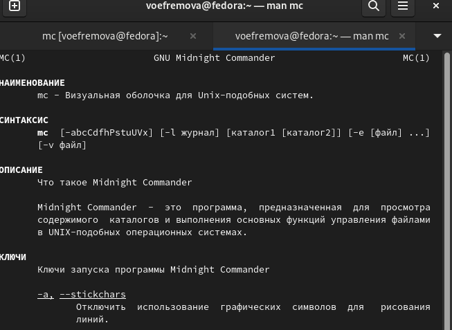

## Второй этап

- Открыли mc через командную строку

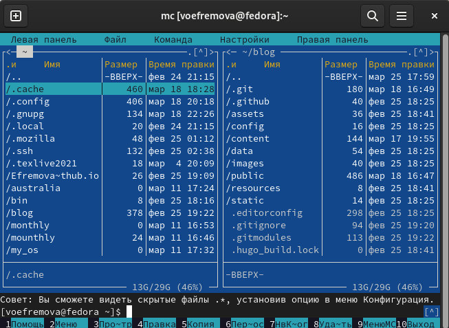

## Третий этап

- Выполнили несколько операций в mc, используя управляющие клавиши (операции с панелями; выделение/отмена выделения файлов, копирование/перемещение файлов, получение информации о размере и правах доступа на файлы и/или каталоги
и т.п.) 

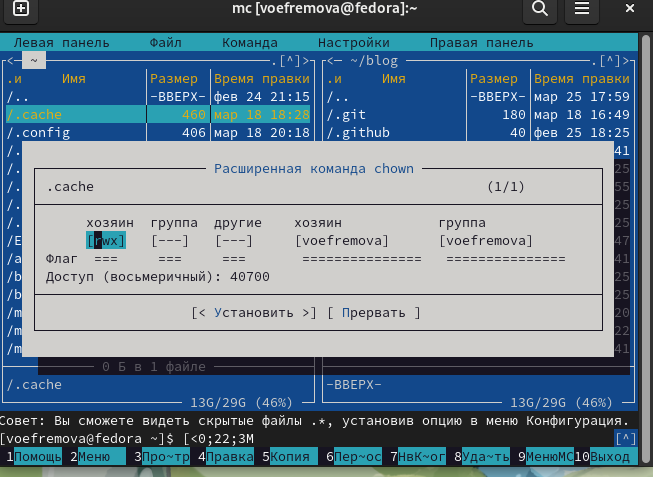

## Четвертый этап

- Выполнили основные команды меню левой  панели и узнали информацию, которая подробно всё показывает

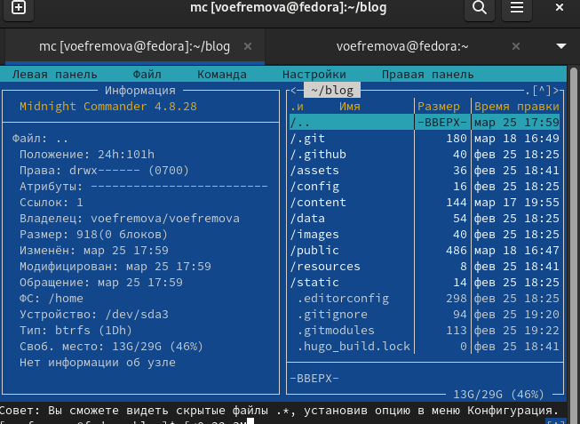

## Пятый этап

- Используя возможности подменю Файл , выполнили некоторые команды: просмотр содержимого текстового файла; редактирование содержимого текстового файла (без сохранения результатов редактирования); создание каталога; копирование в файлов в созданный каталог

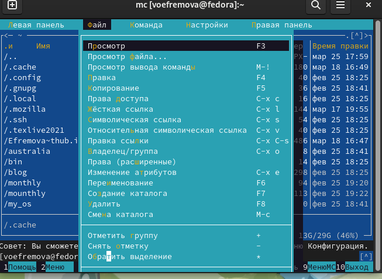

## Шестой этап

- С помощью соответствующих средств подменю Команда осуществили: поиск в файловой системе файла с заданными условиями (например, файла с расширением .c или .cpp, содержащего строку main); выбор и повторение одной из предыдущих команд; переход в домашний каталог

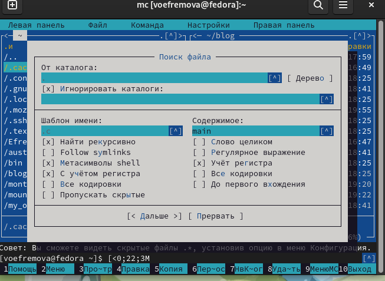

## Седьмой этап

- анализ файла меню(

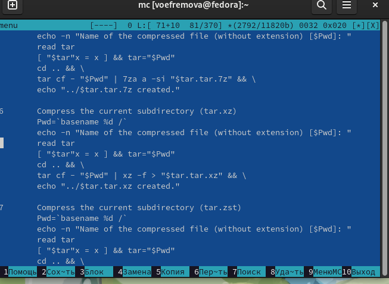

## Восьмой этап

- анализ файла расширений 

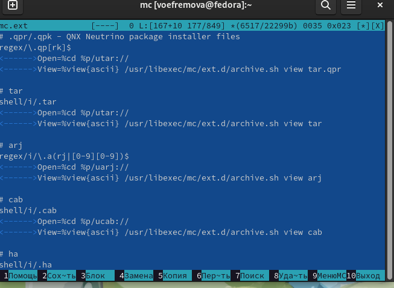

## Девятый этап

- Вызвали подменю Настройки . Освоили операции, определяющие структуру экрана mc
(Full screen, Double Width, Show Hidden Files и т.д.)

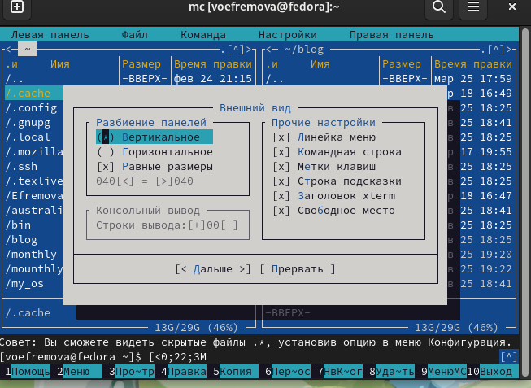

## Десятый этап

- Создали текстовый файл и в него записали текст из поисковой системы

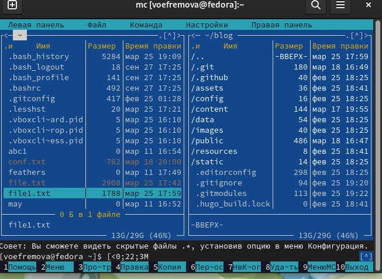

## 11 этап

- После создания мы удалили строку текста, выделили фрагмент текста и скопировали его на новую строку. Потом выделили фрагмент текста и перенесли его на новую строку. Сохранили файл. Отменили последнее действие ctrl+u. Перешли в конец файла (нажав комбинацию клавиш  fn+end) и написали набор букв. Перешли в начало файла (нажав комбинацию клавиш fn+home) и написали набор букв.Сохранили и закрыли файл

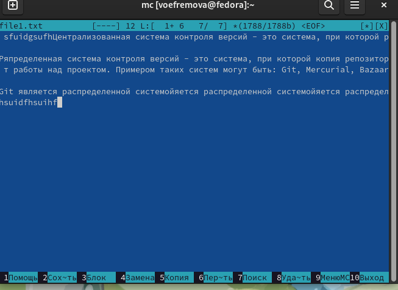

## 12 этап

- Выводим текст в командной строке

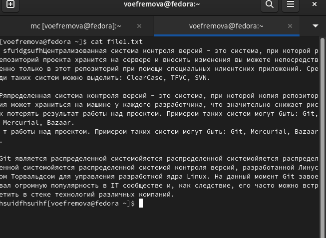

## 13 этап
- отключили подсветку

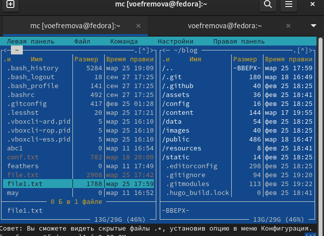

## Вывод

Освоили основные возможности командной оболочки Midnight Commander. Приобрели навыки практической работы по просмотру каталогов и файлов; манипуляций с ними.

:::

