---
## Front matter
title: "Лабораторная работа №7"
author: "Ефремова Вера"

## Generic otions
lang: ru-RU
toc-title: "Содержание"

## Bibliography
bibliography: bib/cite.bib
csl: pandoc/csl/gost-r-7-0-5-2008-numeric.csl

## Pdf output format
toc: true # Table of contents
toc-depth: 2
lof: true # List of figures
lot: true # List of tables
fontsize: 12pt
linestretch: 1.5
papersize: a4
documentclass: scrreprt
## I18n polyglossia
polyglossia-lang:
  name: russian
  options:
	- spelling=modern
	- babelshorthands=true
polyglossia-otherlangs:
  name: english
## I18n babel
babel-lang: russian
babel-otherlangs: english
## Fonts
mainfont: PT Serif
romanfont: PT Serif
sansfont: PT Sans
monofont: PT Mono
mainfontoptions: Ligatures=TeX
romanfontoptions: Ligatures=TeX
sansfontoptions: Ligatures=TeX,Scale=MatchLowercase
monofontoptions: Scale=MatchLowercase,Scale=0.9
## Biblatex
biblatex: true
biblio-style: "gost-numeric"
biblatexoptions:
  - parentracker=true
  - backend=biber
  - hyperref=auto
  - language=auto
  - autolang=other*
  - citestyle=gost-numeric
## Pandoc-crossref LaTeX customization
figureTitle: "Рис."
tableTitle: "Таблица"
listingTitle: "Листинг"
lofTitle: "Список иллюстраций"
lotTitle: "Список таблиц"
lolTitle: "Листинги"
## Misc options
indent: true
header-includes:
  - \usepackage{indentfirst}
  - \usepackage{float} # keep figures where there are in the text
  - \floatplacement{figure}{H} # keep figures where there are in the text
---

# Цель работы

Освоение основных возможностей командной оболочки Midnight Commander. Приоб-
ретение навыков практической работы по просмотру каталогов и файлов; манипуляций
с ними.

# Задание

1. Изучите информацию о mc, вызвав в командной строке man mc.
2. Запустите из командной строки mc, изучите его структуру и меню.
3. Выполните несколько операций в mc, используя управляющие клавиши (операции
с панелями; выделение/отмена выделения файлов, копирование/перемещение фай-
лов, получение информации о размере и правах доступа на файлы и/или каталоги
и т.п.)
4. Выполните основные команды меню левой (или правой) панели. Оцените степень
подробности вывода информации о файлах.
5. Используя возможности подменю Файл , выполните:
– просмотр содержимого текстового файла;
– редактирование содержимого текстового файла (без сохранения результатов
редактирования);
– создание каталога;
– копирование в файлов в созданный каталог.
6. С помощью соответствующих средств подменю Команда осуществите:
– поиск в файловой системе файла с заданными условиями (например, файла
с расширением .c или .cpp, содержащего строку main);
– выбор и повторение одной из предыдущих команд;
– переход в домашний каталог;
– анализ файла меню и файла расширений.
7. Вызовите подменю Настройки . Освойте операции, определяющие структуру экрана mc
(Full screen, Double Width, Show Hidden Files и т.д.)

1. Создайте текстовой файл text.txt.
2. Откройте этот файл с помощью встроенного в mc редактора.
3. Вставьте в открытый файл небольшой фрагмент текста, скопированный из любого
другого файла или Интернета.
4. Проделайте с текстом следующие манипуляции, используя горячие клавиши:
4.1. Удалите строку текста.
4.2. Выделите фрагмент текста и скопируйте его на новую строку.Кулябов Д. С. и др. Операционные системы
69
4.3. Выделите фрагмент текста и перенесите его на новую строку.
4.4. Сохраните файл.
4.5. Отмените последнее действие.
4.6. Перейдите в конец файла (нажав комбинацию клавиш) и напишите некоторый
текст.
4.7. Перейдите в начало файла (нажав комбинацию клавиш) и напишите некоторый
текст.
4.8. Сохраните и закройте файл.
5. Откройте файл с исходным текстом на некотором языке программирования (напри-
мер C или Java)
6. Используя меню редактора, включите подсветку синтаксиса, если она не включена,
или выключите, если она включена.

# Теоретическое введение

Командная оболочка — интерфейс взаимодействия пользователя с операционной систе-
мой и программным обеспечением посредством команд.
Midnight Commander (или mc) — псевдографическая командная оболочка для UNIX/Linux
систем. Для запуска mc необходимо в командной строке набрать mc и нажать Enter .
Рабочее пространство mc имеет две панели, отображающие по умолчанию списки
файлов двух каталогов (рис. 7.1).
Рис. 7.1. Внешний вид экрана при работе с Midnight Commander
Над панелями располагается меню, доступ к которому осуществляется с помощью
клавиши F9 . Под панелями внизу расположены управляющие экранные кнопки, ассоци-
ированные с функциональными клавишами F1 – F10 (табл. 7.1). Над ними располагается
командная строка, предназначенная для ввода команд.Кулябов Д. С. и др. Операционные системы
61
Таблица 7.1
Функциональные клавиши mc
F1
F2
F3
F4
F5
F6
F7
F8
F9
F10
Вызов контекстно-зависимой подсказки
Вызов пользовательского меню с возможностью создания и/или допол-
нения дополнительных функций
Просмотр содержимого файла, на который указывает подсветка в ак-
тивной панели (без возможности редактирования)
Вызов встроенного в mc редактора для изменения содержания файла,
на который указывает подсветка в активной панели
Копирование одного или нескольких файлов, отмеченных в первой
(активной) панели, в каталог, отображаемый на второй панели
Перенос одного или нескольких файлов, отмеченных в первой (актив-
ной) панели, в каталог, отображаемый на второй панели
Создание подкаталога в каталоге, отображаемом в активной панели
Удаление одного или нескольких файлов (каталогов), отмеченных в пер-
вой (активной) панели файлов
Вызов меню mc
Выход из mc
7.2.2. Режимы отображения панелей и управление ими
Панель в mc отображает список файлов текущего каталога. Абсолютный путь к этому
каталогу отображается в заголовке панели. У активной панели заголовок и одна из её
строк подсвечиваются. Управление панелями осуществляется с помощью определённых
комбинаций клавиш или пунктов меню mc.
Панели можно поменять местами. Для этого и используется комбинация клавиш Ctrl-u
или команда меню mc Переставить панели . Также можно временно убрать отображение
панелей (отключить их) с помощью комбинации клавиш Ctrl-o или команды меню mc
Отключить панели . Это может быть полезно, например, если необходимо увидеть вывод
какой-то информации на экран после выполнения какой-либо команды shell.
С помощью последовательного применения комбинации клавиш Ctrl-x d есть
возможность сравнения каталогов, отображённых на двух панелях. Панели могут допол-
нительно быть переведены в один из двух режимов: Информация или Дерево . В режиме
Информация (рис. 7.2) на панель выводятся сведения о файле и текущей файловой системе,
расположенных на активной панели. В режиме Дерево (рис. 7.3) на одной из панелей
выводится структура дерева каталогов.
Управлять режимами отображения панелей можно через пункты меню mc Правая панель
и Левая панель (рис. 7.4).
7.2.3. Меню панелей
Перейти в строку меню панелей mc можно с помощью функциональной клавиши F9 .
В строке меню имеются пять меню: Левая панель , Файл , Команда , Настройки и Правая панель .62
Лабораторная работа № 7. Командная оболочка Midnight Commander
Рис. 7.2. Режим Информация
Рис. 7.3. Режим отображения дерева каталогов
Подпункт меню Быстрый просмотр позволяет выполнить быстрый просмотр содержимого
панели.Кулябов Д. С. и др. Операционные системы
63
Рис. 7.4. Меню Левая Панель
Подпункт меню Информация позволяет посмотреть информацию о файле или каталоге
(рис. 7.5).
Рис. 7.5. Панель Информация
В меню каждой (левой или правой) панели можно выбрать Формат списка :
– стандартный — выводит список файлов и каталогов с указанием размера и времени
правки;
– ускоренный — позволяет задать число столбцов, на которые разбивается панель при
выводе списка имён файлов или каталогов без дополнительной информации;
– расширенный — помимо названия файла или каталога выводит сведения о правах
доступа, владельце, группе, размере, времени правки;64
Лабораторная работа № 7. Командная оболочка Midnight Commander
– определённый пользователем — позволяет вывести те сведения о файле или каталоге,
которые задаст сам пользователь.
Подпункт меню Порядок сортировки позволяет задать критерии сортировки при выводе
списка файлов и каталогов: без сортировки, по имени, расширенный, время правки,
время доступа, время изменения атрибута, размер, узел.
7.2.3.1. Меню Файл
В меню Файл содержит перечень команд, которые могут быть применены к одному
или нескольким файлам или каталогам (рис. 7.6).
Рис. 7.6. Меню Файл
Команды меню Файл :
– Просмотр ( F3 ) — позволяет посмотреть содержимое текущего (или выделенного)
файла без возможности редактирования.
– Просмотр вывода команды ( М + ! ) — функция запроса команды с параметрами
(аргумент к текущему выбранному файлу).
– Правка ( F4 ) — открывает текущий (или выделенный) файл для его редактирования.
– Копирование ( F5 ) — осуществляет копирование одного или нескольких файлов или
каталогов в указанное пользователем во всплывающем окне место.
– Права доступа ( Ctrl-x c ) — позволяет указать (изменить) права доступа к одному
или нескольким файлам или каталогам (рис. 7.7).Кулябов Д. С. и др. Операционные системы
65
Рис. 7.7. Права доступа на файлы и каталоги
– Жёсткая ссылка ( Ctrl-x l ) — позволяет создать жёсткую ссылку к текущему (или
выделенному) файлу1 .
– Символическая ссылка ( Ctrl-x s ) — позволяет создать символическую ссылку к теку-
щему (или выделенному) файлу2 .
– Владелец/группа ( Ctrl-x o ) — позволяет задать (изменить) владельца и имя группы
для одного или нескольких файлов или каталогов.
– Права (расширенные) — позволяет изменить права доступа и владения для одного
или нескольких файлов или каталогов.
– Переименование ( F6 ) — позволяет переименовать (или переместить) один или
несколько файлов или каталогов.
– Создание каталога ( F7 ) — позволяет создать каталог.
– Удалить ( F8 ) — позволяет удалить один или несколько файлов или каталогов.
– Выход ( F10 ) — завершает работу mc.
7.2.3.2. Меню Команда
В меню Команда содержатся более общие команды для работы с mc (рис. 7.8).
Команды меню Команда :
– Дерево каталогов — отображает структуру каталогов системы.
– Поиск файла — выполняет поиск файлов по заданным параметрам.
1
Жёсткая ссылка проявляется как реальный файл. После её создания невозможно определить, где сам файл,
а где ссылка на него. Если удалить один из этих файлов, то другой останется целым.
2
Символическая ссылка — ссылка (указатель) на имя файла-оригинала.66
Лабораторная работа № 7. Командная оболочка Midnight Commander
Рис. 7.8. Меню Команда
– Переставить панели — меняет местами левую и правую панели.
– Сравнить каталоги ( Ctrl-x d ) — сравнивает содержимое двух каталогов.
– Размеры каталогов — отображает размер и время изменения каталога (по умолчанию
в mc размер каталога корректно не отображается).
– История командной строки — выводит на экран список ранее выполненных в оболочке
команд.
– Каталоги быстрого доступа ( Ctrl-\ ) — пр вызове выполняется быстрая смена текущего
каталога на один из заданного списка.
– Восстановление файлов — позволяет восстановить файлы на файловых системах ext2
и ext3.
– Редактировать файл расширений — позволяет задать с помощью определённого син-
таксиса действия при запуске файлов с определённым расширением (например, какое
программного обеспечение запускать для открытия или редактирования файлов с рас-
ширением doc или docx).
– Редактировать файл меню — позволяет отредактировать контекстное меню пользова-
теля, вызываемое по клавише F2 .
– Редактировать файл расцветки имён — позволяет подобрать оптимальную для поль-
зователя расцветку имён файлов в зависимости от их типа.
7.2.3.3. Меню Настройки
Меню Настройки содержит ряд дополнительных опций по внешнему виду и функцио-
нальности mc (рис. 7.9).
Меню Настройки содержит:
– Конфигурация — позволяет скорректировать настройки работы с панелями.
– Внешний вид и Настройки панелей — определяет элементы (строка меню, команд-
ная строка, подсказки и прочее), отображаемые при вызове mc, а также геометрию
расположения панелей и цветовыделение.
– Биты символов — задаёт формат обработки информации локальным терминалом.
– Подтверждение — позволяет установить или убрать вывод окна с запросом подтвер-
ждения действий при операциях удаления и перезаписи файлов, а также при выходе
из программы.
– Распознание клавиш — диалоговое окно используется для тестирования функцио-
нальных клавиш, клавиш управления курсором и прочее.
– Виртуальные ФС –– настройки виртуальной файловой системы: тайм-аут, пароль
и прочее.
7.2.4. Редактор mc
Встроенный в mc редактор вызывается с помощью функциональной клавиши F4 . В нём
удобно использовать различные комбинации клавиш при редактировании содержимого
(как правило текстового) файла

# Выполнение лабораторной работы

1. Изучили информацию о mc, вызвав в командной строке man mc  (рис. @fig:001).

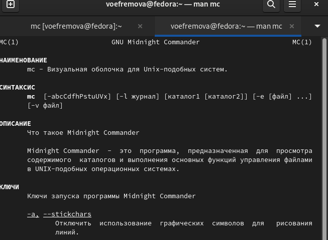{#fig:001 width=70%}

2. Открыли mc через командную строку (рис. @fig:002) 

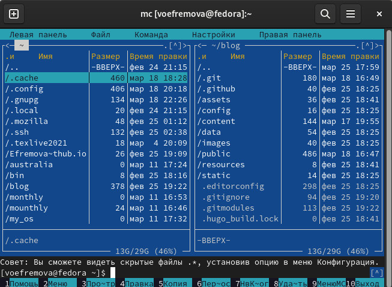{#fig:002 width=70%}

3. Выполнили несколько операций в mc, используя управляющие клавиши (операции с панелями; выделение/отмена выделения файлов, копирование/перемещение файлов, получение информации о размере и правах доступа на файлы и/или каталоги
и т.п.) (рис. @fig:003)

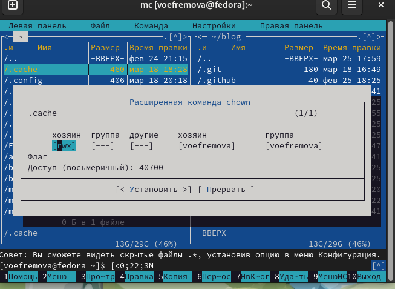{#fig:003 width=70%}

4. Выполнили основные команды меню левой  панели и узнали информацию, которая подробно всё показывает(рис. @fig:004)

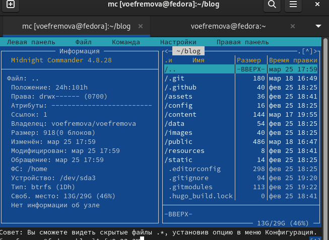{#fig:004 width=70%}

5. Используя возможности подменю Файл , выполнили некоторые команды: просмотр содержимого текстового файла; редактирование содержимого текстового файла (без сохранения результатов редактирования); создание каталога; копирование в файлов в созданный каталог(рис. @fig:005)

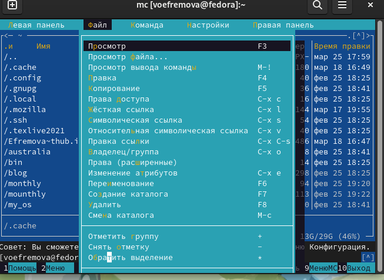{#fig:005 width=70%}

6. С помощью соответствующих средств подменю Команда осуществили: поиск в файловой системе файла с заданными условиями (например, файла с расширением .c или .cpp, содержащего строку main); выбор и повторение одной из предыдущих команд; переход в домашний каталог;(рис. @fig:006)

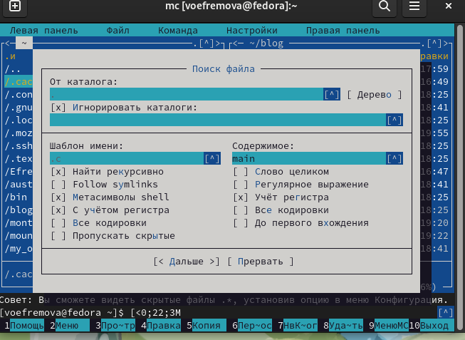{#fig:006 width=70%}

7. анализ файла меню(рис. @fig:007)

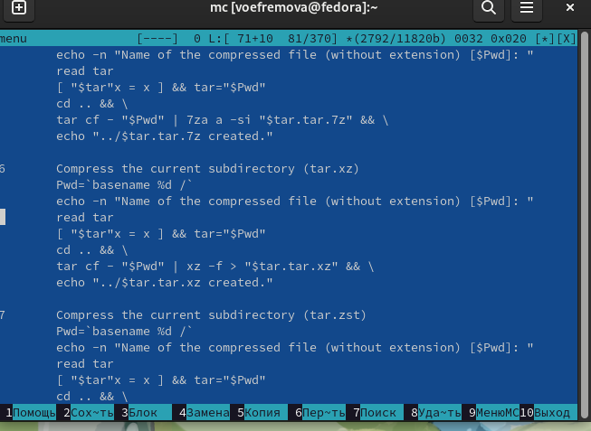{#fig:007 width=70%}

8. анализ файла расширений (рис. @fig:008)

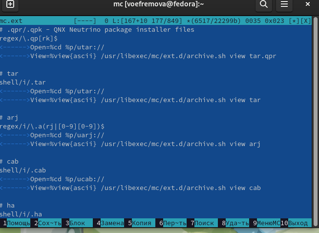{#fig:008 width=70%}

9. Вызвали подменю Настройки . Освоили операции, определяющие структуру экрана mc
(Full screen, Double Width, Show Hidden Files и т.д.)(рис. @fig:009)

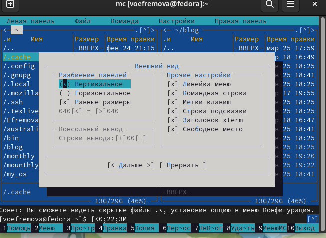{#fig:009 width=70%}

10. Создали текстовый файл и в него записали текст из поисковой системы(рис. @fig:010)

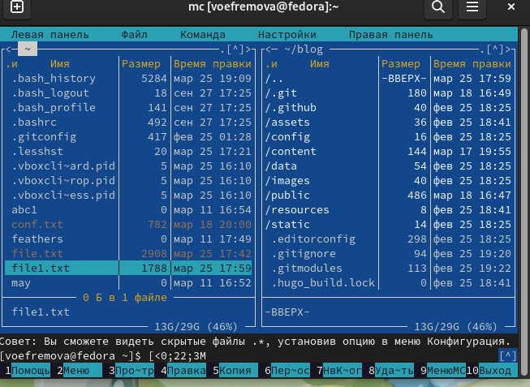{#fig:010 width=70%}

11. После создания мы удалили строку текста, выделили фрагмент текста и скопировали его на новую строку. Потом выделили фрагмент текста и перенесли его на новую строку. Сохранили файл. Отменили последнее действие ctrl+u. Перешли в конец файла (нажав комбинацию клавиш  fn+end) и написали набор букв. Перешли в начало файла (нажав комбинацию клавиш fn+home) и написали набор букв.Сохранили и закрыли файл(рис. @fig:011)

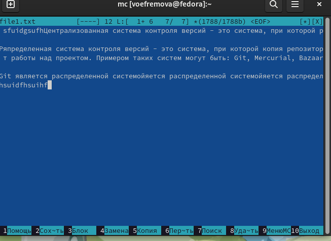{#fig:011 width=70%}

12. Выводим текст в командной строке (рис. @fig:012)

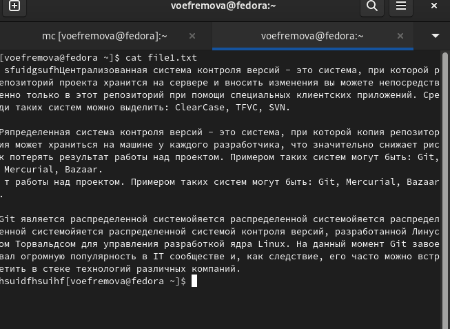{#fig:012 width=70%}

13.  отключили подсветку(рис. @fig:013)

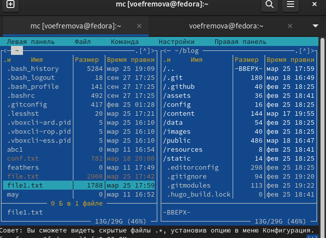{#fig:013 width=70%}

# Выводы

Освоили основные возможности командной оболочки Midnight Commander. Приобрели навыки практической работы по просмотру каталогов и файлов; манипуляций с ними.

::: {#refs}
:::
