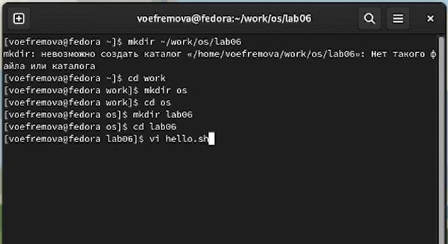
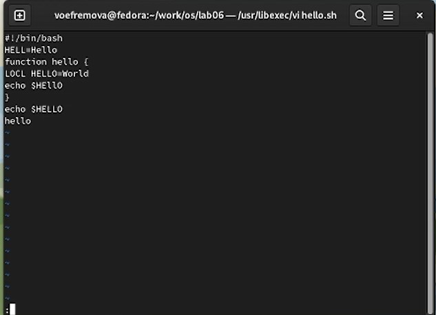
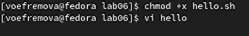
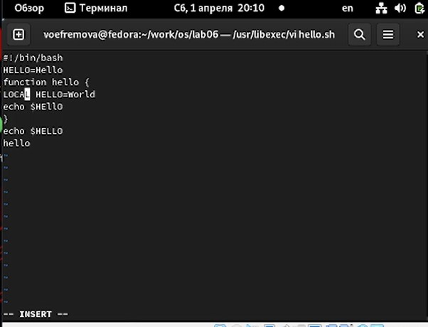
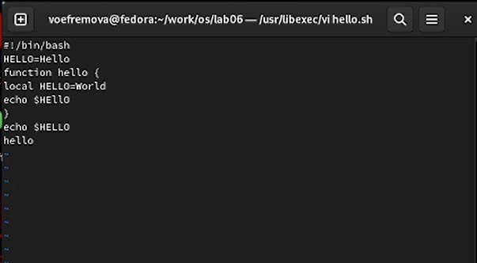
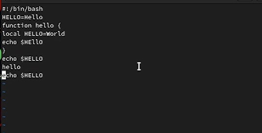
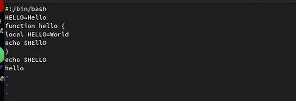

---
## Front matter
lang: ru-RU
title: Презентация к лабораторной работе №8
author:
  - Ефремова Вера
institute:
  - Российский университет дружбы народов, Москва, Россия
date: 1 апреля 2023

## i18n babel
babel-lang: russian
babel-otherlangs: english

## Formatting pdf
toc: false
toc-title: Содержание
slide_level: 2
aspectratio: 169
section-titles: true
theme: metropolis
header-includes:
 - \metroset{progressbar=frametitle,sectionpage=progressbar,numbering=fraction}
 - '\makeatletter'
 - '\beamer@ignorenonframefalse'
 - '\makeatother'
---

# Информация

## Докладчик

:::::::::::::: {.columns align=center}
::: {.column width="70%"}

  * Ефремова Вера
  * студент
  * Направление бизнес-информатика
  * Российский университет дружбы народов
  * [1032225672@rudn.ru]
  * <https://EfremovaVera.github.io/ru/>

:::
::: {.column width="30%"}

:::
::::::::::::::

# Вводная часть

## Объект и предмет исследования

- Командная строка
- Линукс
- Входные и выходные форматы команд

## Цели и задачи

- Познакомиться с операционной системой Linux. Получить практические навыки рабо-
ты с редактором vi, установленным по умолчанию практически во всех дистрибутивах.

# Презентация
## Первый этап

- Создали каталог с именем ~/work/os/lab06.Перешли во вновь созданный каталог.Вызвали vi и создали файл hello.sh

## Второй этап

- Нажали клавишу i и ввели текст из задания. Перешли в командный режим и ввели для записи и выхода :wq, а потом enter для сохранения  

## Третий этап

- Потом мы сделали файл исполняемым и вызвали на редактирование

## Четвертый этап

- С помощью стрелок установили курсор в конец слова HELL второй строки. Перешли в режим вставки i и заменили на HELLO. Нажали на Esc для возврата в командный режим. 

## Пятый этап

- Установили курсор на четвертую строку и стерли слово LOCAL. Перешли в режим вставки и набрали local, нажали Esc для
возврата в командный режим.

## Шестой этап

- Установили курсор на последней строке файла. Вставили после неё строку, содержащую
следующий текст: echo $HELLO, предварительно скопировав данный текст с другой строки.

## Седьмой этап

- Удалили последнюю строку с помощью dd .Ввели команду отмены изменений u для отмены последней команды. Ввели символ : для перехода в режим последней строки. Записали произведённые изменения с помощью wq и вышли.  

## Вывод

Познакомились с операционной системой Linux. Получили практические навыки работы с редактором vi, установленным по умолчанию практически во всех дистрибутивах.

:::

