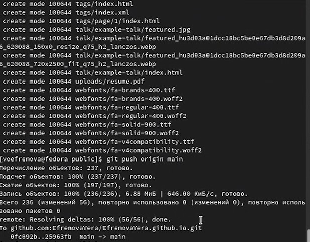

---
## Front matter
lang: ru-RU
title: Структура научной презентации
author:
  - Кулябов Д. С.
institute:
  - Российский университет дружбы народов, Москва, Россия
  date: 25 февраля 2023

## i18n babel
babel-lang: russian
babel-otherlangs: english

## Formatting pdf
toc: false
toc-title: Содержание
slide_level: 2
aspectratio: 169
section-titles: true
theme: metropolis
header-includes:
 - \metroset{progressbar=frametitle,sectionpage=progressbar,numbering=fraction}
 - '\makeatletter'
 - '\beamer@ignorenonframefalse'
 - '\makeatother'
---

# Информация

## Докладчик

:::::::::::::: {.columns align=center}
::: {.column width="70%"}

  * Ефремова Вера
  * студент
  * НБИбд-03-22
  * Российский университет дружбы народов

:::
::: {.column width="30%"}


:::
::::::::::::::

# Вводная часть

## Актуальность

- Создание сайта быстрым способом
- изучение материала

## Объект и предмет исследования

- Линукс и расширения
- Программное обеспечение 

## Цели и задачи

- Научиться с помощью шаблона создавать личный сайт
- понимание материала

## Материалы и методы

- Процессор `pandoc` для входного формата Markdown
- Результирующие форматы
	- `pdf`
	- `html`
- Сообщество Гитхаб


# Выполнение проекта
## Скачаем специальное расширение чрез ссылку, которая была оставлена на ТУИС

{#fig:001 width=70%}

## Клонирование шаблона

{#fig:002 width=70%}

## Код для формата `pdf`

```yaml
slide_level: 2
aspectratio: 169
section-titles: true
theme: metropolis
```


## Переходим в каталог блог и проверяем список файлов.

{#fig:003 width=70%}

## Включение

- мы включаем наше расширение, но перед этим устанавливаем доп пакеты. в данном идёт заполнение файлами. 
{#fig:004 width=70%}

## вывод

- Вывод ссылки сервера, после команды hugo server. Надо по ссылке перейти на локальный хост 
{#fig:005 width=70%}

##  Проверка работы сайта на локальном хостинге

{#fig:006 width=70%}

## Создание 

- Создание нового репозитория с личным ником на гитхабе, который будет являться ссылкой 
{#fig:007 width=70%}

## Клонируем новый репозиторий, создаётся новый каталог. Переходим в новый каталог и переключаемся на новую ветку 

{#fig:010 width=70%}
{#fig:008 width=70%}

## Создаём и закидываем файл для чтения

- Переход в каталог блог и настройка публикации файлов на гитхаб через файл паблик. создание паблика автоматическое
{#fig:011 width=70%}

## Корректировка

  - В файле гитигнор закомментируем слово паблик и посмотрим результат 

{#fig:012 width=70%}

  - повторяем команду, загружаем файлы и обновляем репозиторий
  {#fig:013 width=70%}

## переход по новой ссылке на сайт и проверка работы сайта

::: incremental

{#fig:014 width=70%}

:::


