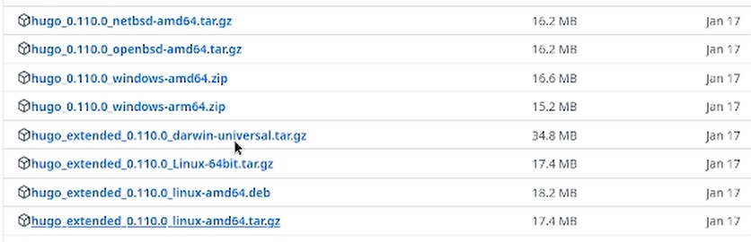
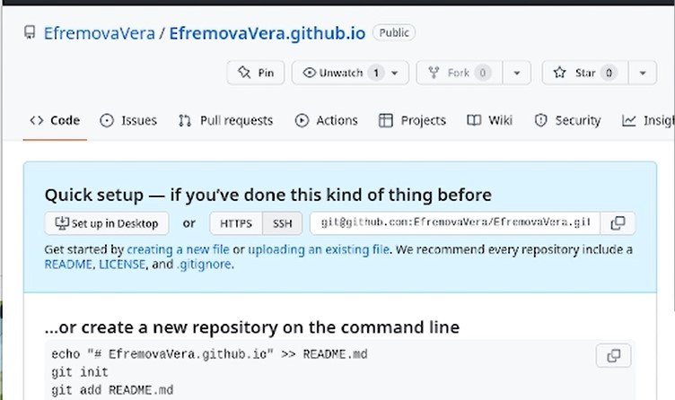

---
## Front matter
title: "Отчёт по индивидуальному проекту. Этап 1"
author: "Ефремова Вера"

## Generic otions
lang: ru-RU
toc-title: "Содержание"

## Bibliography
bibliography: bib/cite.bib
csl: pandoc/csl/gost-r-7-0-5-2008-numeric.csl

## Pdf output format
toc: true # Table of contents
toc-depth: 2
lof: true # List of figures
lot: true # List of tables
fontsize: 12pt
linestretch: 1.5
papersize: a4
documentclass: scrreprt
## I18n polyglossia
polyglossia-lang:
  name: russian
  options:
	- spelling=modern
	- babelshorthands=true
polyglossia-otherlangs:
  name: english
## I18n babel
babel-lang: russian
babel-otherlangs: english
## Fonts
mainfont: PT Serif
romanfont: PT Serif
sansfont: PT Sans
monofont: PT Mono
mainfontoptions: Ligatures=TeX
romanfontoptions: Ligatures=TeX
sansfontoptions: Ligatures=TeX,Scale=MatchLowercase
monofontoptions: Scale=MatchLowercase,Scale=0.9
## Biblatex
biblatex: true
biblio-style: "gost-numeric"
biblatexoptions:
  - parentracker=true
  - backend=biber
  - hyperref=auto
  - language=auto
  - autolang=other*
  - citestyle=gost-numeric
## Pandoc-crossref LaTeX customization
figureTitle: "Рис."
tableTitle: "Таблица"
listingTitle: "Листинг"
lofTitle: "Список иллюстраций"
lotTitle: "Список таблиц"
lolTitle: "Листинги"
## Misc options
indent: true
header-includes:
  - \usepackage{indentfirst}
  - \usepackage{float} # keep figures where there are in the text
  - \floatplacement{figure}{H} # keep figures where there are in the text
---

# Цель работы

Цель работы создать в 1 этапе сайт на основе шаблона и сделать его общедоступным на гитхабе.

# Теоретическое введение

Здесь описываются теоретические аспекты, связанные с выполнением работы.

Например, в табл. @tbl:std-dir приведено краткое описание стандартных каталогов Unix.

: Описание некоторых каталогов файловой системы GNU Linux {#tbl:std-dir}

| Имя каталога | Описание каталога                                                                                                          |
|--------------|----------------------------------------------------------------------------------------------------------------------------|
| `/`          | Корневая директория, содержащая всю файловую                                                                               |
| `/bin `      | Основные системные утилиты, необходимые как в однопользовательском режиме, так и при обычной работе всем пользователям     |
| `/etc`       | Общесистемные конфигурационные файлы и файлы конфигурации установленных программ                                           |
| `/home`      | Содержит домашние директории пользователей, которые, в свою очередь, содержат персональные настройки и данные пользователя |
| `/media`     | Точки монтирования для сменных носителей                                                                                   |
| `/root`      | Домашняя директория пользователя  `root`                                                                                   |
| `/tmp`       | Временные файлы                                                                                                            |
| `/usr`       | Вторичная иерархия для данных пользователя                                                                                 |

Более подробно об Unix см. в [@gnu-doc:bash;@newham:2005:bash;@zarrelli:2017:bash;@robbins:2013:bash;@tannenbaum:arch-pc:ru;@tannenbaum:modern-os:ru].

# Выполнение лабораторной работы

1. Скачаем специальное расширение чрез ссылку, которая была оставлена на ТУИС:(рис. @fig:001).

{#fig:001 width=70%}

2. Клонирование шаблона. (рис. @fig:002)

{#fig:002 width=70%}

3. Переходим в каталог блог и проверяем список файлов. (рис. @fig:003)

{#fig:003 width=70%}

4. мы включаем наше расширение, но перед этим устанавливаем доп пакеты. в данном идёт заполнение файлами. (рис. @fig:004)

{#fig:004 width=70%}

5. Вывод ссылки сервера, после команды hugo server. Надо по ссылке перейти на локальный хост (рис. @fig:005)

{#fig:005 width=70%}

6. Проверка работы сайта на локальном хостинге. (рис. @fig:006)

{#fig:006 width=70%}

7. Создание нового репозитория с личным ником на гитхабе, который будет являться ссылкой  (рис. @fig:007)

{#fig:007 width=70%}

8. Клонируем новый репозиторий, создаётся новый каталог (рис. @fig:008)

{#fig:008 width=70%}

9. Переходим в новый каталог и переключаемся на новую ветку (рис. @fig:009)

{#fig:009 width=70%}

10. Создаём и закидываем файл для чтения (рис. @fig:010)

{#fig:010 width=70%}

11. Переход в каталог блог и настройка публикации файлов на гитхаб через файл паблик. создание паблика автоматическое (рис. @fig:011)

{#fig:011 width=70%}

12. Корректировка. В файле гитигнор закомментируем слово паблик и посмотрим результат (рис. @fig:012)

{#fig:012 width=70%}

13. повторяем команду, загружаем файлы и обновляем репозиторий (рис. @fig:013)

{#fig:013 width=70%}

14. переход по новой ссылке на сайт и проверка работы сайта (рис. @fig:014)

{#fig:014 width=70%}

# Выводы

Мы научились с помощью расширения и шаблонов создать личный сайт для дальнейших корректировок

::: {#refs}
:::
