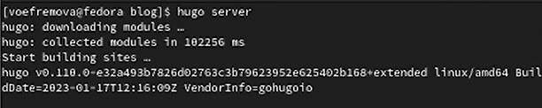
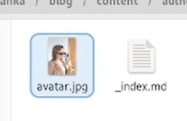
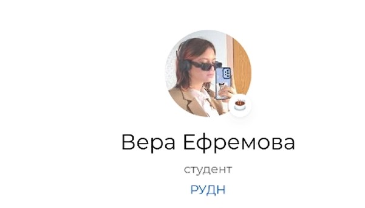
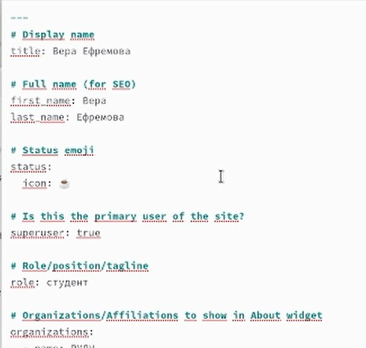
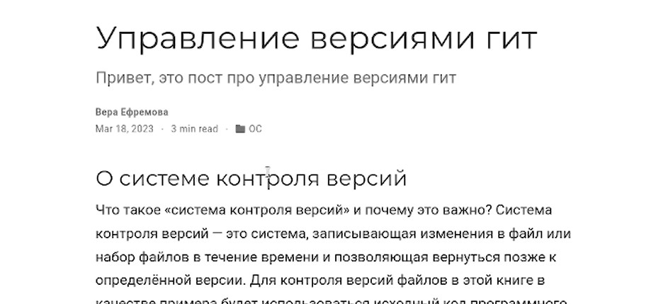

---
## Front matter
lang: ru-RU
title: Индивидуальный проект 2 этап
author:
  - Ефремова Вера
institute:
  - Российский университет дружбы народов, Москва, Россия
date: 18 марта 2023

## i18n babel
babel-lang: russian
babel-otherlangs: english

## Formatting pdf
toc: false
toc-title: Содержание
slide_level: 2
aspectratio: 169
section-titles: true
theme: metropolis
header-includes:
 - \metroset{progressbar=frametitle,sectionpage=progressbar,numbering=fraction}
 - '\makeatletter'
 - '\beamer@ignorenonframefalse'
 - '\makeatother'
---

# Информация

## Докладчик

:::::::::::::: {.columns align=center}
::: {.column width="70%"}

  * Ефремова Вера
  * студент
  * Направление бизнес-информатика
  * Российский университет дружбы народов
  * [1032225672@rudn.ru]
  * <https://EfremovaVera.github.io/ru/>

:::
::: {.column width="30%"}

:::
::::::::::::::

# Вводная часть

## Объект и предмет исследования

- Командная строка
- Линукс
- Входные и выходные форматы команд

## Цели и задачи

- Научиться оформлять сайт, выкладывать посты, менять фотографию и описание.

# Презентация
## Первый этап

- Запустили сервер и открыли его.

## Второй этап

- В файлах поменяли фотографию  

## Третий этап

- Смотрим как поменялась фотография на сайте

## Четвертый этап

- Заходим в контент и меняем описание про себя, пишем о своих интересах, маленькую биографию и краткая информация

## Пятый этап

- Создаём в посте папку и выкладываем там пост про прошедшею неделю

## Шестой этап

- ТАм же создаём новцю папку и постим на тему управление версиями гит 

## Седьмой этап

- Сохранение обновленного сайта

## Вывод

Мы научились оформлять сайт, выкладывать посты, менять фотографию и описание

:::

